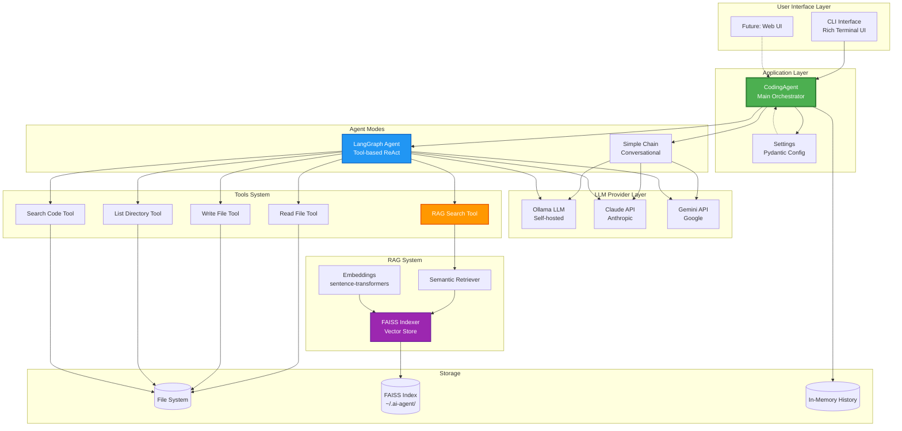
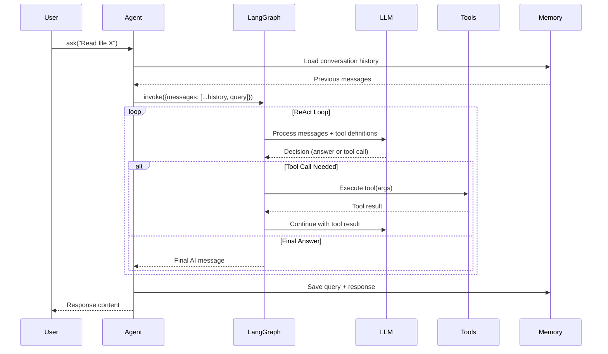
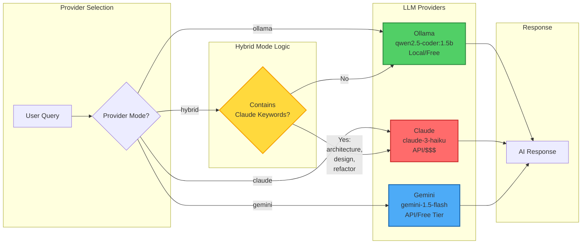
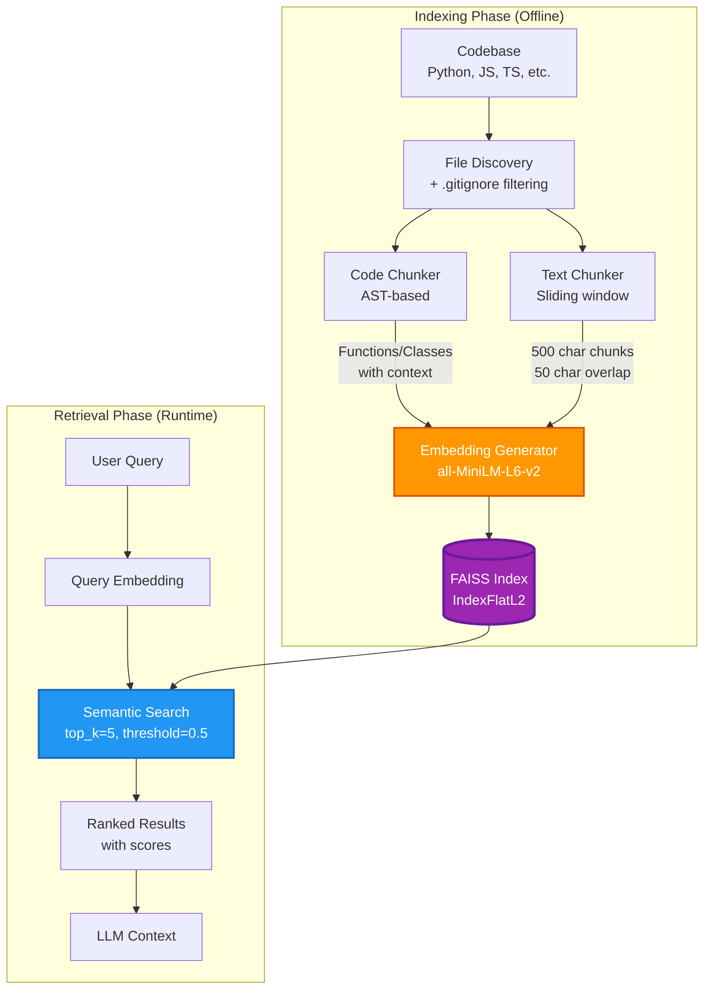
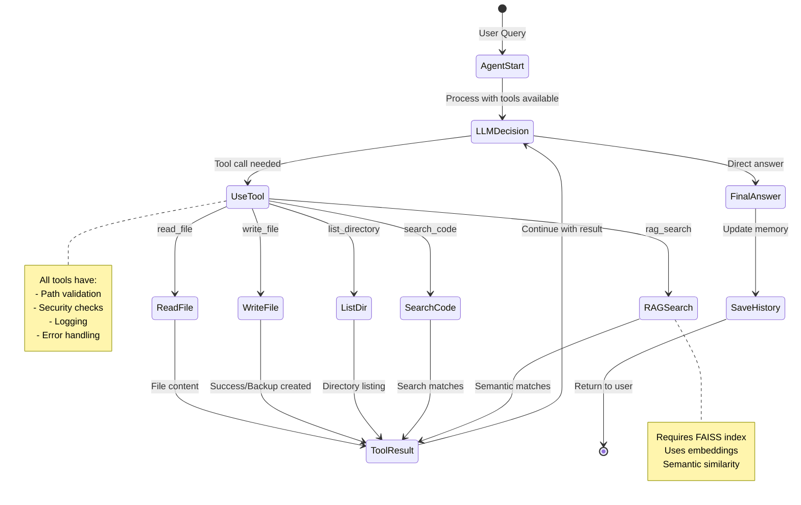
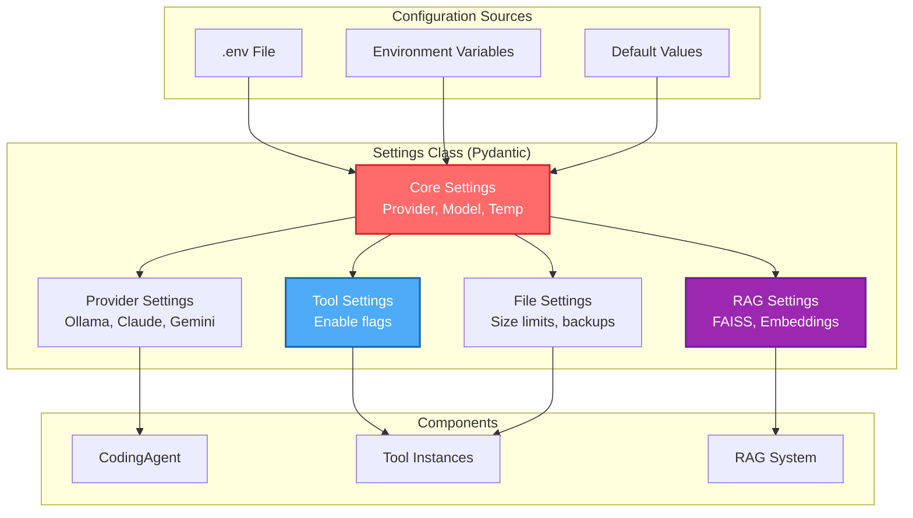
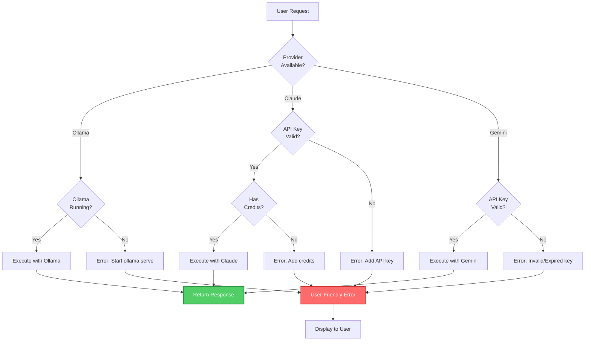
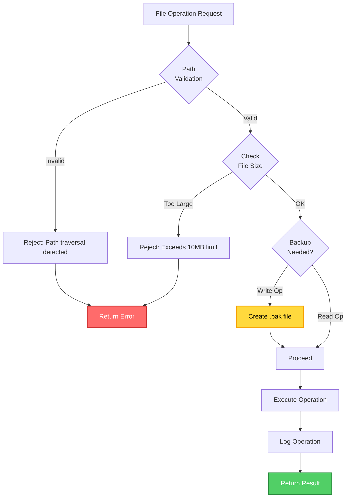
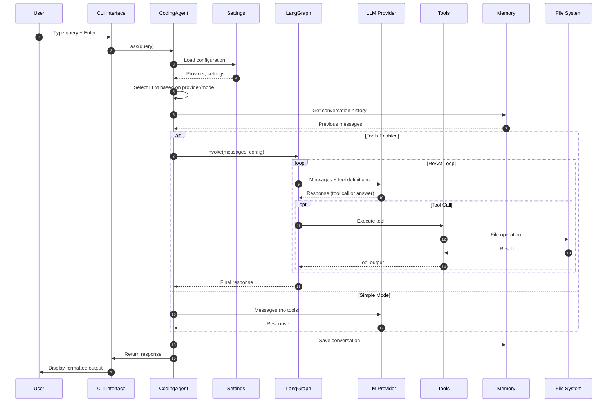

# Architecture Diagrams - AI Coding Agent

This document contains Mermaid diagrams visualizing the project architecture and data flows.

---

## 1. Overall System Architecture



---

## 2. LangGraph Agent Execution Flow



---

## 3. Multi-Provider System



---

## 4. RAG System Architecture



---

## 5. Tool Execution Flow



---

## 6. Conversation Memory Flow

```mermaid
graph LR
    subgraph "Session Management"
        SessionID[Session ID<br/>default]
        Store[(InMemory Store<br/>Dict[str, History])]
    end

    subgraph "Message Flow"
        UserMsg[User Message]
        History[Load History]
        Processing[LLM Processing]
        AIMsg[AI Response]
        Save[Save to History]
    end

    subgraph "LangGraph Memory"
        Checkpointer[MemorySaver<br/>Checkpointer]
        ThreadID[Thread ID]
    end

    SessionID --> Store
    UserMsg --> History
    Store --> History
    History --> Processing
    Processing --> AIMsg
    AIMsg --> Save
    Save --> Store

    ThreadID --> Checkpointer
    Processing --> Checkpointer
    Checkpointer --> Processing

    style Store fill:#4CAF50,stroke:#2E7D32,stroke-width:2px,color:#fff
    style Checkpointer fill:#2196F3,stroke:#1565C0,stroke-width:2px,color:#fff
```

---

## 7. Configuration System



---

## 8. Error Handling & Fallback



---

## 9. File Operation Security



---

## 10. Complete Request Lifecycle



---

## How to View These Diagrams

### Option 1: GitHub (Recommended)
- Push this file to GitHub
- View in browser - GitHub renders Mermaid automatically

### Option 2: VS Code
- Install "Markdown Preview Mermaid Support" extension
- Open this file
- Click preview button (Ctrl+Shift+V)

### Option 3: Online Viewer
- Visit: https://mermaid.live/
- Copy-paste any diagram code
- View rendered output

### Option 4: Command Line
```bash
# Install mermaid-cli
npm install -g @mermaid-js/mermaid-cli

# Generate PNG from this file
mmdc -i ARCHITECTURE_DIAGRAMS.md -o architecture.png
```

---

## Diagram Key

| Color | Meaning |
|-------|---------|
| 🟢 Green | Success states, working components |
| 🔴 Red | Error states, critical components |
| 🔵 Blue | LangGraph, processing, retrieval |
| 🟣 Purple | RAG system, vector operations |
| 🟠 Orange | Tools, embeddings |
| 🟡 Yellow | Decision points, hybrid routing |

---

## Legend

- **Solid arrows** (→): Direct flow/dependency
- **Dashed arrows** (⇢): Optional/future feature
- **Thick borders**: Critical components
- **Subgraphs**: Logical grouping of components
- **Diamonds**: Decision points
- **Cylinders**: Data storage
- **Rectangles**: Processing units
